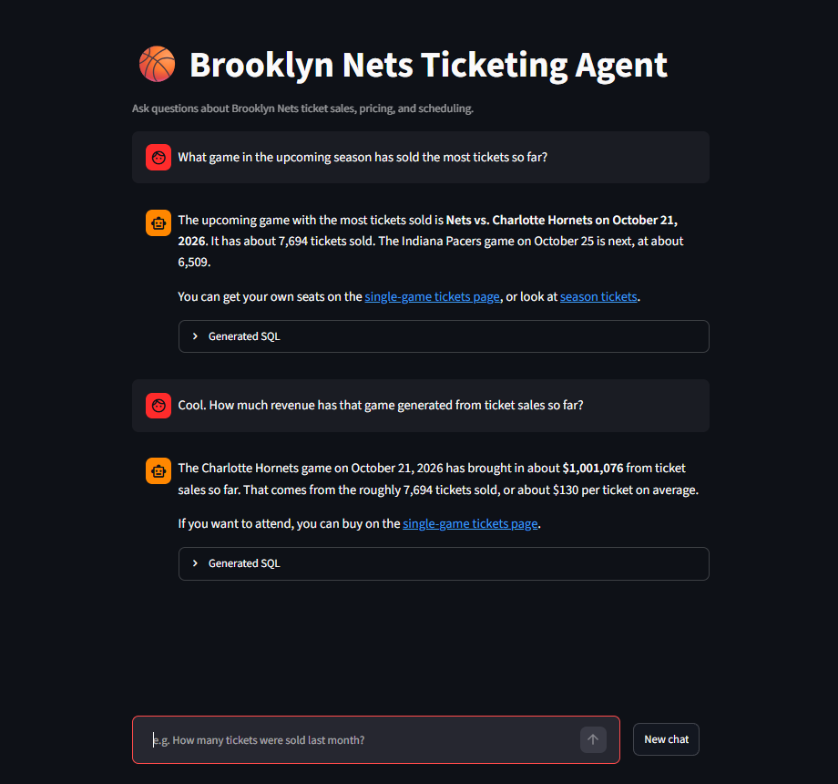
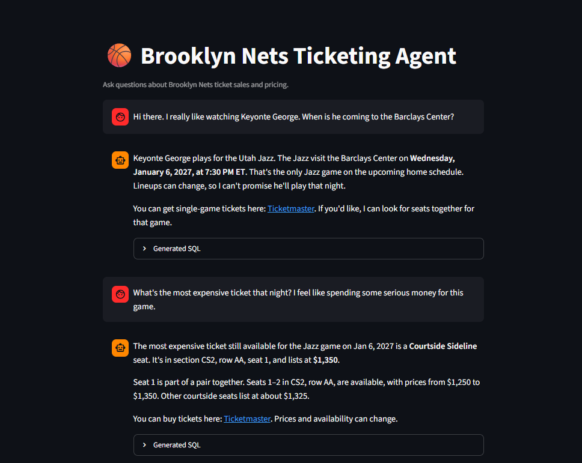
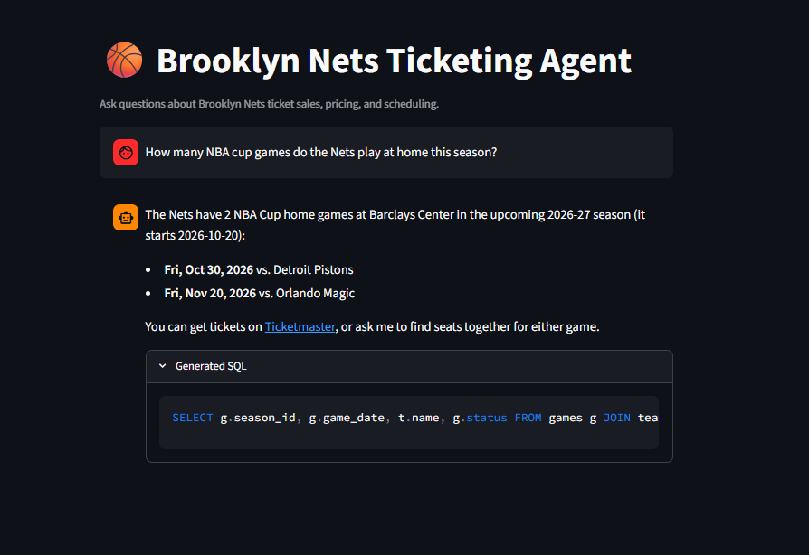

# Brooklyn Nets NLQ Ticketing Agent

An agent designed to answer questions on Brooklyn Nets home games at the Barclays Center. Grounded by a combination of simulated and real data based on 2 seasons of Nets home games and the Barclays Center layout, users are able to ask questions to a Langchain SQL agent that aims to help assist on scheduling, ticketing, and other related questions.

## Goal

There is tremendous value in providing the ability for non-technical users to access data like an analyst. This agent is scoped on Nets home games: seating, ticketing, and scheduling. The agent should give 'up to date' ticket availability and pricing (availability and pricing are both simulated), and help with related questions without the need for a SQL query on the data itself.



## Setup

Requires Python 3.14+. Put an Anthropic API key in `.env` as `ANTHROPIC_API_KEY`. `.env.example` has the variable names.

### With uv

[uv](https://docs.astral.sh/uv/) installs Python 3.14 from `.python-version`. Install uv first if the command is not found.

Windows (PowerShell):

```powershell
powershell -ExecutionPolicy ByPass -c "irm https://astral.sh/uv/install.ps1 | iex"
```

macOS and Linux:

```bash
curl -LsSf https://astral.sh/uv/install.sh | sh
```

```bash
uv sync
uv run db/build_db.py
```

`uv sync` writes `.venv`. The build writes `db/data/bkse.db`.

### Without uv

Ensure you have at least Python 3.14 yourself, then from the repo root:

```bash
python -m venv .venv
```

Windows: `.venv\Scripts\activate`

macOS and Linux: `source .venv/bin/activate`

```bash
pip install -r requirements.txt
python db/build_db.py
```

`requirements.txt` is exported from `uv.lock`, so these versions match `uv sync`. Regenerate it with the command at the top of that file when dependencies change.

## Dataset

The dataset is centered around real 2025-26 data (with the exception for pricing which was simulated), the upcoming 2026-27 schedule, a modeled Barclays Center seat map, and synthetic prices and sales for future games. The tables are `teams`, `seasons`, `games`, `sections`, `seats`, `orders`, and `tickets`. The views are `v_tickets` and `v_available_blocks`. Column detail, the pricing model, and known limits are in [db/DATA.md](db/DATA.md).

## Approach

I decided to closely follow a very simple paradigm largely solved by LangChain's [create_sql_agent method](https://reference.langchain.com/python/langchain-community/agent_toolkits/sql/base/create_sql_agent): the model sees the schema, writes a query, runs it through a SQL tool, reads the result, and answers. At the end of the day, the `create_sql_agent` prebuilt into LangChain is a perfect fit for this solution. With some tweaking to the defaults to make things more explicitly secure on our end, a guided system prompt grounding the agent in predicted business rules, and some extended functionality developed to enhance the experience for the user, the solution here is efficient and has the ability to scale.

Other related implementation ideas include:

- **RAG over table metadata:** useful for larger schemas. This schema is small enough to fetch in one `sql_db_schema` call, so it stays out of the prompt.
- **MCP connector:** expose the same tools to an existing client such as Claude, so the client can call them mid-conversation. Worth revisiting if the goal shifts from a standalone app to a client integration. This isn't an agent, but depending on usecase might be an interesting option.

The interface is a simple Streamlit app. Users chat with the agent, and earlier messages stay in context so follow-ups work. A new chat clears that context. The answer comes back when the agent finishes, and the SQL it ran is under the reply.

Example of a follow-up that depends on memory:

> When do the Nets play the Knicks next?
>
> What's the cheapest ticket that night?

The second question should be answered directly from the first, not returned as "I can't tell.", or "I don't know what you mean."

### Business Rules

I've also taken liberties within the prompting to help answer edge case questions that are more driven for other scopes. For example, questions about concerts at the arena or the Liberty get bounced back immediately with the agent redirecting the user.

Single-game and season-ticket purchases are out of scope for the agent, so those requests get pointed to a BKSE representative contact or Ticketmaster to help further assist.

In addition to that, any questions about the team that can't be answered are prompted to direct the user to the team's official X account for more information.

The agent comes fit with a quality of life tool, `lookup_player`. This was included so that a user can ask a question such as:

> 'I love watching Giannis. When does he come to town?'

And the agent will be able to assert that Giannis plays for the Miami Heat, and can provide ticketing information for those upcoming games. The agent is also instructed not to guarantee that a player is available on a given night - with injuries and scheduled rest days, we don't want the agent to promise something that we can't confirm.



## Model

For the model powering the agent, I went with Claude Sonnet 5.5. With the task given, most models could probably do the trick, but I decided to go with the newer Sonnet model as I find it to be a good balance of speed, performance, and cost. Historically, Claude models perform better than average for agentic workflows, so they're always a decent choice.

## Safety

The prompt tells the model what it may do. The database connection enforces the rest:

- **Read-only connection:** SQLite is opened with `mode=ro`, so a write fails at the file. This wasn't left up to prompt engineering, and was established in code.
- **SELECT-only:** the query tool allows a statement that starts with `SELECT` or `WITH`. Anything else is rejected. A write hidden after `WITH` still fails on the read-only file.
- **Output limits:** a query returns at most 20 rows to the model.
- **Scope:** single-game and season-ticket purchases go to Ticketmaster or the season-ticket line. Other events at the building, including the Liberty, go to the venue site. A named NBA player is looked up rather than guessed to reduce the chance of the agent hallucinating information (this happened during testing, so I decided to create the tool instead.)

## Run

With uv:

```bash
uv run streamlit run app.py
```

Without uv, from the activated virtual environment:

```bash
streamlit run app.py
```

## Usage

Simply converse with the agent! You can ask any questions related to the scope of the database, and the agent will provide helpful answers along with the SQL it ran to support its answer.

If your current chat is going too long, you can start a new chat, which will refresh the agent context.



## Tradeoffs and known issues

A simple tradeoff was going with the `create_sql_agent` approach instead of designing a more intentional agent with fully custom functionality. I was prepared to design a custom ReAct loop that had access to the schema of the database, potentially a call to sample table data so the agent can see the output, and a call to obviously execute the SQL based on what the agent concluded. But in a production agent, I wouldn't recreate this functionality if it already existed. In my research before starting, I learned that this was something that was already developed. I started testing with it just to see how it worked, and while observing the traces in LangSmith, I noticed that it had the exact tools I was planning on developing natively. With not reinventing the wheel as a core concept of software development, I considered this a win.

Another thing I considered before this approach was integrating RAG as a means to infer what table/s were relevant for the user query. And as this scales, this idea would make increasingly more sense.

## Next steps

- **Role-based access:** *depending on if this is to be an internal tool or customer facing* - tie access to Microsoft Entra ID (or other company SSO), so leadership, developers, and accounting each see the data they need and no more. Different roles have different needs, and the agent is most useful when it serves each one in the correct way.
- **MCP connector:** a possible abstraction of the agentic layer - expose the same tools in a connector so existing clients can call them. Also an interesting idea if an internal tool.
- **Smart ticket prompting:** provide the user the direct link to purchase tickets for a game they have inquired about. Not worth implementing in this example, but something that would enhance the user experience in production.
- **Database abstraction**: similar to RBAC, in production, we would likely have at least dozens more tables to pick information from. As that grows, we would need to become stricter with what columns/tables the agent is able to call. As a random example, we wouldn't want a user to see that a seat they want is taken, and then to query for the phone number of the person  who bought the seat.
- **Scaling and deployment:** we would need to answer data related questions, and figure out how we want this agent to be implemented in production. This would include using a non-local database, and a larger amount of abstraction considering the larger scale of available data - the agent would have to be more closely restricted on what it can access, rather than what it can't.

## AI tools used

- Claude helped develop the database structure and build script, and researched the Barclays Center seating layout and home schedule. This was the bulk of the time-consuming setup work.
- Cursor (Plan Mode) was used to discuss implementation. Outside of autocomplete and one-off debugging fixes, the agent layer was written almost entirely by hand with reference to the LangChain documentation and other agents I've pushed to production.
- The Streamlit app was a collaborative effort. I had built the first iteration, but as it grew, I reached to AI for some code assistance to help on features such as creating a new chat to reduce context, and some of the scaling as the agent started to hold memory of previous chats.

